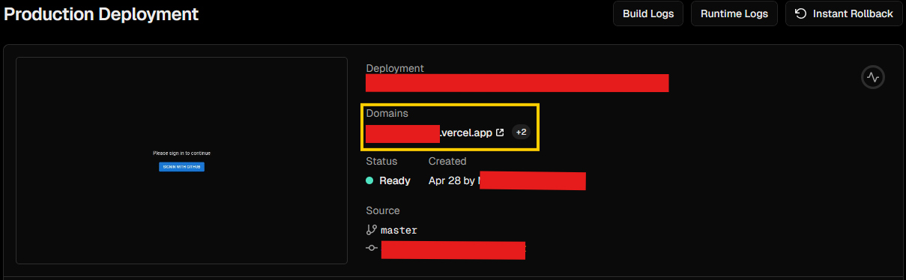

# How to Deploy the Ultimate Attendance App
We will assume that you are deploying to Vercel.
## Before setting up

1. Install git, nodejs on your computer.
2. Fork this project into your own github account.
3. Deploy this newly forked repo on Vercel. [Guide](https://vercel.com/docs/git#deploying-a-git-repository)
4. Note down your public deployment url. 
    
    It should look like (something.vercel.app)
    
    !Attention! The url should NOT include your username.

    Example photo:
    
    Your deployment url is in the yellow box.

5. Clone this newly forked repo into your local computer.

## Preparing environment variables
### Overview
The environmental variables contains the following fields:

`AUTH_SECRET=`<will be created with `npx auth secret`>

`AUTH_GOOGLE_ID` and `AUTH_GOOGLE_SECRET` will be generated in Google Cloud Platform

`DATABASE_URL` will include your database connection string. It is recommended to use a postgres database. (The development environment is using [neondb](https://neon.tech))

`DEFAULT_PROFESSORS_EMAILS` is a json formated string containing professor emails.

Example: `DEFAULT_PROFESSORS_EMAILS="professor@example.com,teaching_assistant@example.com,course_assistant@example.com"`

`TOTP_DIGITS=8` and `TOTP_PERIOD=2` is used in one-time-secret generating. (Dev recommend to set it as is.)

### Preparing AUTH_SECRET

1. Open a terminal in this directory.
2. run `npm install` to install all dependencies.
3. run `npx auth secret` to generate auth.js secret.
4. You should see a `.env.local` file in the directory.

### Preparing `AUTH_GOOGLE_ID` and `AUTH_GOOGLE_SECRET`
1. Please follow [Google's tutorial](https://developers.google.com/identity/protocols/oauth2/web-server?hl=zh-cn#creatingcred) on obtaining these info.
2. For `Authorized JavaScript origins` please use your public deployment url above.
3. For `Authorized redirect URIs` please use your public deployment url above, plus "/api/auth/callback/google"
    
    For example: Your public deploy url is `http://example.com`

    Then your `Authorized JavaScript origins` is `http://example.com`

    Your `Authorized redirect URIs` is `http://example.com/api/auth/callback/google`
4. You should now see `client id` and `client secret` on your screen. Add it to the `.env.local` file as below:

    `AUTH_GOOGLE_ID="google id here"`
    
    `AUTH_GOOGLE_SECRET="google secret here"`

### Preparing `DATABASE_URL`
1. Please follow the guide here: [NeonDB Guide](https://neon.tech/docs/manage/databases#create-a-database)
2. And this [guide](https://neon.tech/docs/connect/connect-from-any-app)
3. Paste the connection string in the `.env.local` file

    `DATABASE_URL="connection string here"`

### Adding `DEFAULT_PROFESSORS_EMAILS`
Paste and modify the following:
`DEFAULT_PROFESSORS_EMAILS="professor@example.com,teaching_assistant@example.com,course_assistant@example.com"`

Be careful on the quotation marks and commas. Emails should be separated by commas without space before or after.

### Adding TOTP related variables
Copy and paste the following

    TOTP_DIGITS=8
    TOTP_PERIOD=2

## Updating Vercel Env Variables
Follow the guide here: [Guide](https://vercel.com/docs/environment-variables/managing-environment-variables)

Tips: you can copy everything from the env file and paste it in browser. Vercel will automatically convert and separate it into different environment variables.

## Triggering vercel re-deploy
In order for the new environment varible to work, you need to trigger a re-deploy.

Don't worry, it's easy. Just delete the following line, save the file, commit the change and push to your github repository.

    Delete me, save the file, commit the change and push for re-deployment.